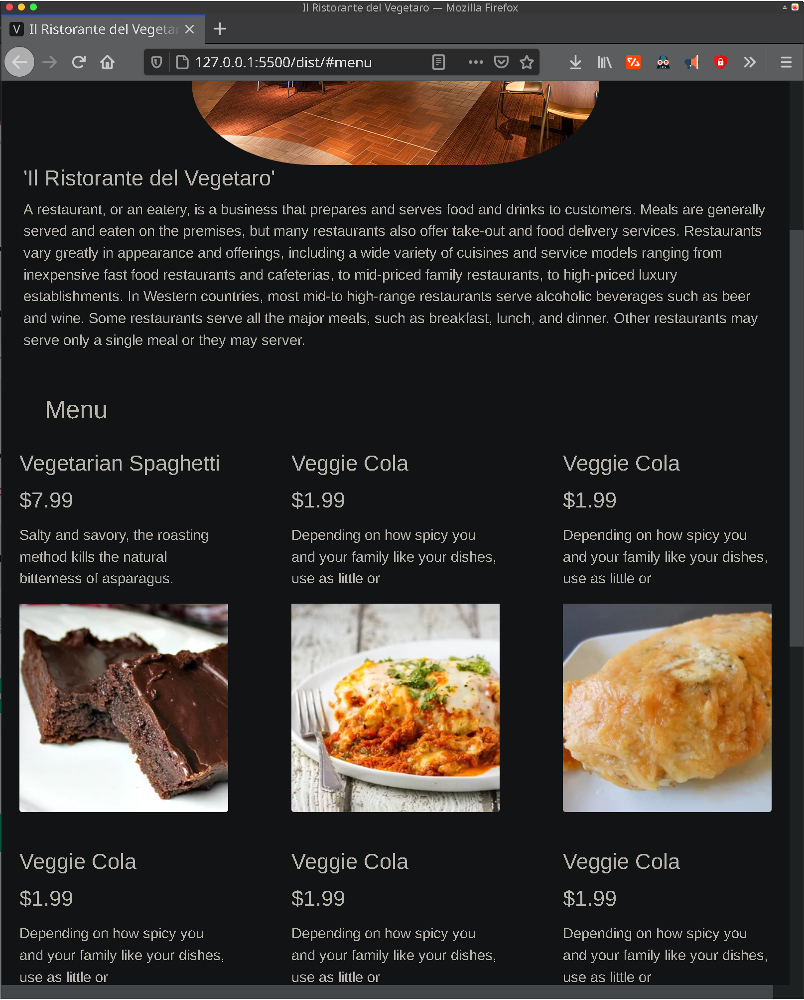

# Restaurant Page


Here I built a basic restaurant page using only JavaScript modules and webpack. All pages are generated using Javascript DOM manipulation and HTML Element creation.
## Built With

- JavaScript;
- Webpack;
- Bootstrap 4;

## Getting Started

```$ npm install --save-dev webpack```

To get a local copy of the repository please run the following commands on your terminal:

```
$ cd <folder>
```

```
$ git clone https://github.com/zilton7/restaurant-page.git
```

```
$ cd restaurant-page
```

```
$ point your browser to 'dist/index.html'
```

## AUTHOR

**ZIL NORVILIS**

- Github: [](https://github.com/zilton7)
- Linkedin: [](https://www.linkedin.com/in/zil-norvilis/)
- Twitter: [](https://twitter.com/devnor7)


## Show your support

Give a ⭐️ if you like this project!

## Acknowledgments

- Hat tip to anyone whose code was used.
- Inspiration
- etc
